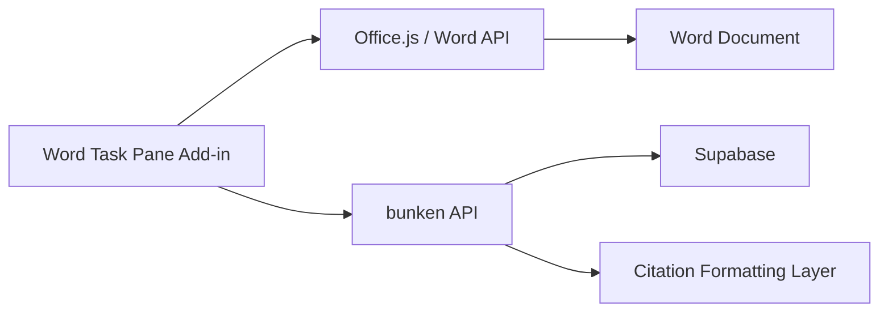

# Architecture

## 目的

`bunken` を文献データの中心にしながら、Word 上で Zotero に近い体験を提供する。

実現したい操作:
- 文献検索
- 本文への引用挿入
- 参考文献一覧の自動生成
- 引用スタイル変更時の一括更新

## 非機能要件

- Word on Windows / Word on Mac の両対応
- 文書共有時に破綻しにくい
- 再生成可能な構造を保つ
- 認証情報を文書本体へ保存しない

## 採用アーキテクチャ



## 中核設計

### 1. 引用はプレーンテキスト + ContentControl

引用表示そのものは本文内の通常テキストとして扱う。
ただし、再編集と再生成のために `ContentControl` にメタデータをひも付ける。

例:
- 表示: `(Suzuki, 2024)`
- 内部状態:
  - `citationId: "cit_001"`
  - `paperIds: ["paper_123"]`
  - `style: "apa"`
  - `locator: "p. 25"`

### 2. 参考文献は専用ブロックを再生成

参考文献一覧は文末に専用 `ContentControl` を置き、その中身を丸ごと再生成する。
手編集を許すよりも、再現性を優先する。

### 3. 文書状態はアドイン側で管理

文書全体の citation state は JSON で管理する。

候補:
- `Office.context.document.settings`
- 将来的に `customXmlParts`

MVP では実装が軽い `document.settings` を優先する。

## データモデル

```ts
type CitationRecord = {
  citationId: string;
  controlId?: number;
  paperIds: string[];
  style: "apa" | "vancouver" | "nature";
  locator?: string;
  prefix?: string;
  suffix?: string;
  renderedText: string;
};

type DocumentState = {
  version: 1;
  bibliographyControlId?: number;
  style: "apa" | "vancouver" | "nature";
  citations: CitationRecord[];
};
```

## bunken 側との責務分離

### bunken API が持つ責務

- 文献検索
- 文献詳細取得
- citation 用の整形済み文字列生成
- bibliography 用の整形済み文字列一覧生成

### Add-in 側が持つ責務

- ユーザー操作
- Word 選択範囲の制御
- content control の作成と識別
- 文書状態の保存と再同期

## 更新フロー

### 引用挿入

1. アドインで文献を選ぶ
2. `bunken API` へ citation 整形を依頼
3. 選択位置へ文字列を挿入
4. 挿入範囲を `ContentControl` 化
5. `DocumentState` を保存

### 参考文献更新

1. `DocumentState` から paper 一覧を集める
2. `bunken API` へ bibliography 整形を依頼
3. 参考文献ブロックを探す
4. 既存ブロックがあれば置換、なければ末尾に挿入

### スタイル変更

1. スタイルを切り替える
2. 全 citation を順に再整形
3. 本文内の表示を更新
4. bibliography も再生成

## クロスプラットフォーム上の判断

- 採用する:
  - Task Pane Add-in
  - `ContentControl`
  - `Range.insertText`
  - `document.settings`

- 依存を避ける:
  - VSTO
  - COM
  - Windows 固有 UI 連携
  - 組み込み bibliography/source master list への強依存

## 将来拡張

- CSL JSON 対応
- 複数文献同時引用
- 引用の一括一覧表示
- 引用の unlink
- Word on the web 対応
